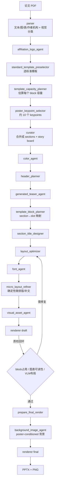

# Paper2Poster

Paper2Poster 是一个把论文 PDF 自动转换成学术海报的多智能体系统（基于 LangGraph）。它从论文解析、内容提炼、模板适配、版面渲染，到视觉质量检查和最终 PPTX / PNG 输出，走完一条完整的 research prototype pipeline。

系统当前已能生成**可编辑的 PowerPoint 海报**，支持标准模板库、无模板自适应布局、局部 / 全局 VLM 质检、以及基于最终 poster 生成的淡色学术背景图。默认输出一张横版、内容填满、可读性优先的标准海报，横版效果明显优于竖版。

> 设计事实来源：领域术语见 [`CONTEXT.md`](CONTEXT.md)，架构决策见 [`docs/adr/`](docs/adr/)。真实运行流程以 [`src/workflow/pipeline.py`](src/workflow/pipeline.py) 的 `create_workflow_graph` 为准。

---

## 功能概览

- **PDF 解析**：抽取正文、作者、机构、图、表和结构化章节，统一建立 `visual_assets`。
- **内容规划**：从全文提取约 10 个 poster-worthy keypoints，作为内容池，由 curator 合并成 4–7 个 poster sections。
- **模板优先填充**：先确定模板和每个 block 的容量，再按容量组织文字和视觉资产，让初稿就接近目标利用率（尽量零留白）。
- **确定性微排版**：micro-layout 避免重叠、溢出、文字越界，并在 block 偏空时从论文事实中补充内容。
- **多层质检**：局部（每个 block 的空 / 挤 / 溢出 / 图表可读性）+ 全局（标题可读性、留白、阅读顺序、视觉层级）。
- **可控多样性**：默认稳定输出 `cluster_43_landscape`；用户可显式指定任意标准模板 / 风格 / 背景，作为可复现的 Poster Variant。
- **降级而非静默失败**：外部服务（VLM、图像生成）失败时走确定性兜底，并在产物中记录 Degraded Quality State。
- **最终输出**：可编辑 `.pptx` + 预览 `.png`，附带 `timing_cost_log.json` 成本日志和各阶段 JSON 报告。

---

## 完整流程



**为什么是「模板优先」而不是「生成后硬修」**：先选模板 → 计算每个 block 容量 → 再生成对应长度的内容，让初稿就接近目标利用率，减少反复重排和大面积留白。

---

## 核心设计原则

详见 [`docs/adr/`](docs/adr/)。要点：

1. **默认标准变体 + 显式多样性**（[ADR 0001](docs/adr/0001-controlled-diversity.md) / [0002](docs/adr/0002-user-specified-variants-with-standard-default.md)）
   不指定时默认走 `auto` → 稳定落到 `cluster_43_landscape`（横版、开启默认 teaser / 背景）。多样性来自用户**显式指定**模板 / 风格 / 生成资产，每个变体记录模板、Style Profile、seed，可复现。
2. **用户请求的模板不被静默替换**（[ADR 0008](docs/adr/0008-user-requested-templates-are-not-silently-replaced.md)）
   显式指定的模板即使兼容性弱也会被尊重，靠质量门 / 修复决定成败；仅 `auto` 选择的变体允许模板回退。
3. **零留白由确定性逻辑保证**：目标 block 利用率 `target=0.965`、`final_min=0.96`。偏空只允许从论文事实补充内容，偏挤只允许压缩 / 删减，**禁止编造论文没有的结果**。
4. **确定性缺陷阻塞，可选服务失败降级**（[ADR 0003](docs/adr/0003-generative-asset-fallbacks-are-deterministic-and-degraded.md) / [0006](docs/adr/0006-deterministic-quality-failures-block-optional-service-failures-degrade.md)）
   溢出 / 重叠 / 缺产物 / 无关领域内容泄漏等确定性缺陷会 reject；VLM / 图像 API 不可用则走确定性兜底并记录为 Degraded State。
5. **VLM 只做检查和小修，不主导布局**；**背景图最后加**，不影响正文 / 图表 / logo 排版。

---

## 安装

推荐 Python 3.11。

```bash
python -m venv .venv
source .venv/bin/activate
pip install -r requirements.txt
```

或使用 `uv`：

```bash
uv sync
```

---

## 环境变量

参考 [`.env.example`](.env.example) 创建 `.env`（不要提交 `.env` 或任何真实 API key）。

**文本模型**（内容生成）：

```bash
OPENAI_API_KEY=your_key
OPENAI_BASE_URL=https://your-text-endpoint/v1
OPENAI_API_BASE=https://your-text-endpoint/v1
# 默认文本模型 gpt-5.4，可覆盖：
PAPER2POSTER_TEXT_MODEL=gpt-5.4
```

**VLM 质检**（截图审阅）：

```bash
VLM_API_KEY=your_vlm_key
VLM_BASE_URL=https://your-vlm-endpoint/v1
VLM_MODEL=gpt-5.4
```

**背景 / teaser 图像生成**：

```bash
IMAGE_API_KEY=your_image_key
IMAGE_BASE_URL=https://your-image-endpoint/v1
IMAGE_MODEL=gpt-image-2
# 可选：多个中转站轮询 + fallback 模型
IMAGE_BASE_URLS="https://ep1/v1 https://ep2/v1 https://ep3/v1"
IMAGE_MODELS="gpt-image-2 gemini-3.1-flash-image-preview"   # 或 IMAGE_FALLBACK_MODELS
IMAGE_RETRY_ATTEMPTS=5
IMAGE_RETRY_DELAY_SECONDS=6
```

> **⚠️ 推理模型的 temperature 限制**：`gpt-5.x` / `o1` / `o3` / `o4` 等推理模型**只接受默认 temperature（1）**。pipeline 已自动对这些模型省略 / 固定 temperature；如果你换用别的推理模型端点，遇到 `400 "operation not allowed in this deployment"`，通常就是端点拒绝了非默认 temperature，属正常限制。见「故障排查」。

---

## 快速开始

查看可用模板：

```bash
PYTHONPATH=. .venv/bin/python -m src.workflow.pipeline --list-layout-templates
```

**推荐运行方式**（默认标准变体 + 全部生成资产 + 质检）：

```bash
PYTHONPATH=. .venv/bin/python -m src.workflow.pipeline \
  data/Active_Geospatial_Search_for_Efficient_Tenant_Eviction_Outreach/paper.pdf \
  --layout-template auto \
  --logo data/Active_Geospatial_Search_for_Efficient_Tenant_Eviction_Outreach/logo.png \
  --aff-logo data/Active_Geospatial_Search_for_Efficient_Tenant_Eviction_Outreach/aff.png \
  --poster-style navy_serif \
  --visual-density rich \
  --enable-generated-teaser \
  --enable-generated-background \
  --background-style auto \
  --background-palette auto
```

固定使用某个横版模板：

```bash
PYTHONPATH=. .venv/bin/python -m src.workflow.pipeline <paper.pdf> \
  --layout-template cluster_104_landscape --enable-generated-background
```

无模板自适应模式：

```bash
PYTHONPATH=. .venv/bin/python -m src.workflow.pipeline <paper.pdf> --layout-template adaptive_auto
```

---

## 命令行参数

| 参数 | 说明 |
|---|---|
| `paper.pdf`（位置参数）/ `--paper_path` | 输入论文 PDF |
| `--layout-template` | `auto`（默认 → `cluster_43_landscape`）/ 任意 `cluster_*` 标准模板 / `adaptive_auto` |
| `--poster-style` | `navy_serif`（默认）/ `teal_modern` / `burgundy_classic` |
| `--visual-density` | `lean` / `balanced`（默认）/ `rich`（图表多、表格可读时用） |
| `--enable-generated-background` `--background-style` `--background-palette` | 生成淡色学术背景；style/palette 支持 `auto` 及多种预设 |
| `--enable-generated-teaser` | 为 introduction/motivation block 生成顶会风格概念图 |
| `--header-route` `--header-subtitle` `--header-title-wrap` `--header-seed` | header 版式、副标题、标题换行策略、可复现随机种子 |
| `--section-title-numbering` | `off`（默认）/ `small` / `inline` |
| `--logo` / `--conference` | 会议 logo：本地路径，或按会议名从本地库解析（见「Logo 素材」） |
| `--aff-logo` / `--enable-affiliation-logos` / `--disable-affiliation-logos` | 机构 logo：默认自动搜索下载；也可手动传本地图或显式关闭自动检索 |
| `--affiliation-logo-mode` | 放几个机构 logo：`single`（默认，1 个）或 `multi`（1–3 个，按实际解析到的数量） |
| `--text_model` `--vision_model` `--vlm-model` | 覆盖模型 |
| `--enable-vlm-layout-review` `--enable-visual-legibility-review` `--enable-block-vlm-review` `--enable-adaptive-column-width` | 质检 / 自适应开关（选用 `cluster_*` 标准模板时自动开启前三项） |
| `--list-layout-templates` | 列出模板后退出 |

---

## 模板库

标准模板来自：

```text
模版-横向/   # 横版 cluster_*_template.json + 预览图
模版-竖向/   # 竖版 cluster_*_template.json + 预览图
```

运行时给模板 ID 加方向后缀避免同名冲突，例如 `cluster_27_landscape` / `cluster_27_portrait`。当前白名单（`config/poster_config.yaml` 的 `standard_template_policy`）：

- **横版（16）**：`cluster_2/6/14/16/27/36/39/43/46/62/69/70/85/86/96/104 _landscape`
- **竖版（8）**：`cluster_3/8/13/15/22/25/27/29 _portrait`

建议：默认 `auto`（→ `cluster_43_landscape`）；图表密集论文可显式用 `cluster_104_landscape`；竖版目前作为实验能力保留，不建议作为默认展示。

---

## Logo 素材

**会议 logo（`src/utils/conference_logos.py`）——本地素材库，不联网下载**：
`--conference "AAAI"` 会把会议名归一化后到 `assets/conference_logos/` 里匹配本地 PNG（当前内置 `aaai` / `iclr` / `neurips`）。要用其他会议，把 logo 放进该目录，或直接用 `--logo <path>` 指定任意本地图片（`--logo` 优先级高于 `--conference`）。

**机构（学校）logo（`src/agents/affiliation_logo_agent.py`）——默认自动搜索下载**：
默认启用，默认放 **1 个**学校 logo（`--affiliation-logo-mode single`）；传 `--affiliation-logo-mode multi` 则放 1–3 个（按实际解析到的数量，上限见 config `max_logos`）；`--disable-affiliation-logos` 关闭。解析流程：先用 **OpenAlex 按标题/DOI 搜**得到规范机构名（修正 parser 抽取的乱名，对 arXiv 也有效）→ 依次尝试 **本地目录 → 官方站点 URL → Wikimedia Commons → Wikidata → Clearbit autocomplete 拿真实域名 → favicon 兜底取图**（Clearbit 官方 logo API 已停服，故用 favicon 兜底）。相关映射配置在 `config/poster_config.yaml` 的 `affiliation_logos` 段。也可以用 `--aff-logo <path>` 手动传一张本地机构 logo。

---

## 输出结构

```text
output/<paper_directory_name>/
├── <paper>.pptx / <paper>.png          # 最终可编辑海报 + 预览
├── <paper>_draft.pptx / _draft.png     # 质检前的草稿
├── timing_cost_log.json                # 耗时 / API 调用 / token 成本
├── assets/                             # 抽取的 figure/table、生成背景、resolved 资产
└── content/                            # 各阶段 JSON 报告（可调试）
    ├── poster_keypoint_selection.json  # 论文被切成哪些 keypoints
    ├── story_board.json                # keypoints 如何合并成 sections
    ├── styled_layout.json              # 最终元素位置和字体
    ├── block_occupancy_report.json     # 各 block 利用率（留白检查）
    └── final_quality_gate.json         # 最终是否通过 + 失败原因 + 降级状态
```

---

## 测试

```bash
PYTHONPATH=. .venv/bin/python -m pytest tests/test_pipeline_contracts.py -q
```

当前本地结果：**222 passed**。这是一套契约 / 回归测试（Pipeline Harness），保护核心 pipeline 不退化，不是评测 benchmark。

---

## 故障排查

- **`400 "operation not allowed in this deployment"` / VLM `response.failed`**：多半是给推理模型（`gpt-5.x`）传了非默认 `temperature`。pipeline 已对推理模型自动省略 temperature；若换端点仍报此错，确认该端点 / 中转站是否禁用了对应操作。
- **图像生成全部失败（`分组 auto 下模型 X 的可用渠道不存在`）**：你的图像中转站没有 `IMAGE_MODEL` / fallback 模型的可用渠道。换一个该中转站真实拥有的图像模型（设 `IMAGE_MODEL` 或 `IMAGE_MODELS`），或多配几个 `IMAGE_BASE_URLS`。图像失败不影响出图，只是没有背景 / teaser（走降级）。
- **中转站偶发 5xx / 拒绝**：多渠道中转站可能间歇性失败；VLM 请求已内置重试，文本 / 图像也有重试与多 URL 轮询。留白消除的主力是**确定性逻辑**，即使 VLM 偶尔降级，海报仍能填满、通过质量门。
- **竖版留白 / 挤压**：竖版 block 少、比例不稳定，建议优先用横版。

---

## 目录结构

```text
paper2poster/
├── assets/                  # 会议 logo 等静态资源
├── config/                  # 配置和 prompts（poster_config.yaml + prompts/）
├── data/                    # demo 论文和本地测试输入
├── docs/adr/                # 架构决策记录（ADR 0001–0008）
├── CONTEXT.md               # 领域术语表（设计事实来源）
├── output/                  # 生成结果，可删除重跑
├── src/
│   ├── agents/              # pipeline 各阶段 agent
│   ├── layout/              # 模板选择和布局辅助
│   ├── state/               # PosterState 状态定义
│   ├── template_extraction/ # 模板 registry 和抽取
│   ├── tools/               # image / layout / pptx 封装
│   ├── utils/               # 文本清洗、logo、风格选项
│   └── workflow/            # pipeline 入口
├── 模版-横向/ 模版-竖向/     # 标准模板库
├── tests/                   # 契约 / 回归测试
├── requirements.txt
└── README.md
```

## 重点模块

- [`src/workflow/pipeline.py`](src/workflow/pipeline.py)：主流程、CLI、`create_workflow_graph`、最终质量门。
- [`src/agents/parser.py`](src/agents/parser.py)：PDF 解析、图表抽取、视觉分类。
- [`src/agents/poster_keypoint_selector.py`](src/agents/poster_keypoint_selector.py)：论文 keypoint 提取。
- [`src/agents/template_capacity_planner.py`](src/agents/template_capacity_planner.py)：模板 block 容量估计。
- [`src/agents/curator.py`](src/agents/curator.py)：poster 内容规划 / story board。
- [`src/layout/template_selector.py`](src/layout/template_selector.py)：`auto` 模板选择。
- [`src/agents/template_block_planner.py`](src/agents/template_block_planner.py)：section → slot 映射。
- [`src/agents/micro_layout_refiner.py`](src/agents/micro_layout_refiner.py)：确定性微排版、补文、留白控制。
- [`src/agents/block_occupancy_analyzer.py`](src/agents/block_occupancy_analyzer.py)：block 利用率计算。
- [`src/agents/vlm_layout_reviewer.py`](src/agents/vlm_layout_reviewer.py)：VLM 截图质检（含重试）。
- [`src/agents/background_image_agent.py`](src/agents/background_image_agent.py)：poster-conditioned 背景生成。
- [`src/agents/renderer.py`](src/agents/renderer.py)：PPTX / PNG 渲染。

---

## 已知问题

1. 竖版模板效果较差（block 少、比例不适合 dense paper）。
2. `auto` 默认稳定输出 `cluster_43_landscape`；模板多样性需用户显式指定模板。
3. VLM final gate 有帮助，但不能完全替代人工目视检查。
4. 图表可读性仍是难点（目前主要靠裁剪、缩放、必要时转文字总结，尚未重绘图表）。
5. 运行时间较长（含 PDF 解析、LLM、VLM、背景图、微排版）。
6. 生成结果是可编辑 PPTX，最终展示前可能仍需人工微调。

---

## 致谢

本项目基于 [Y-Research-SBU/PosterGen](https://github.com/Y-Research-SBU/PosterGen) 演进而来。
