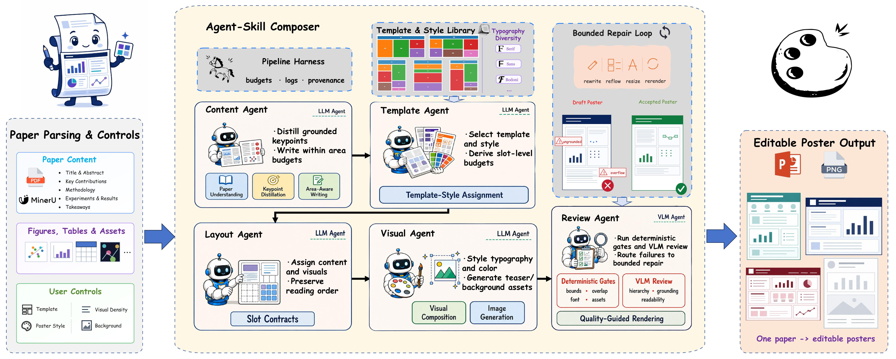
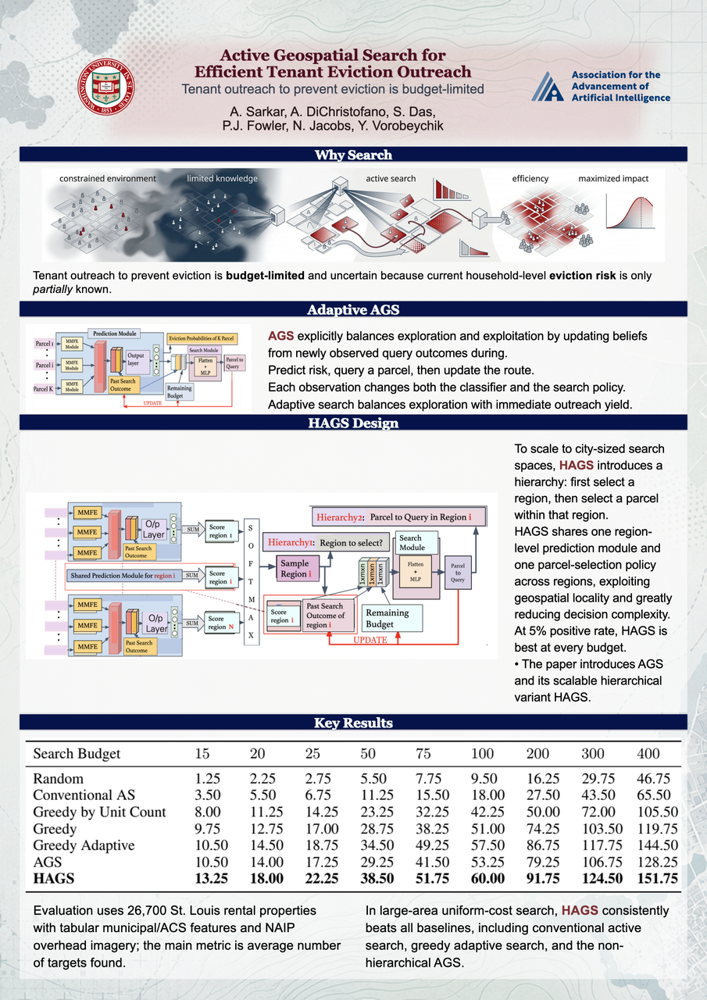
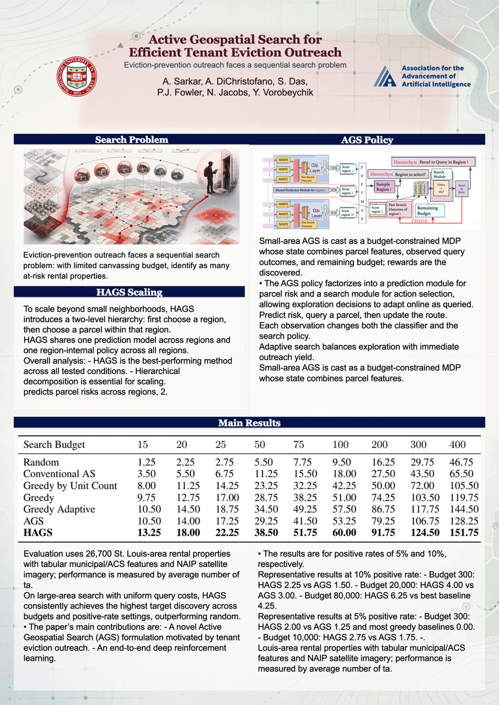
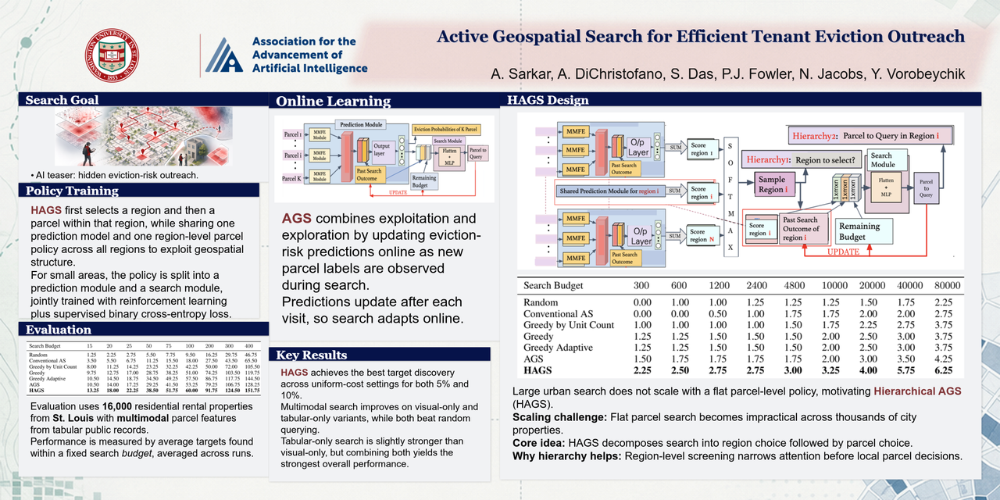

<div align="center">
  
  <h1>PosterMELD</h1>
  <p><strong>PosterMELD: Multi-Agent Paper-to-Poster Generation for Design Diversity with Editable Print-Ready Outputs</strong></p>
  <p><strong>M</strong>ulti-Agent · <strong>E</strong>ditable · <strong>L</strong>ayouts · <strong>D</strong>esign diversity</p>
  <p>从论文 PDF 生成具有设计多样性、可编辑且可直接打印的学术海报</p>

  <p>
    <a href="https://jackey0903.github.io/PosterLoom/"><strong>项目展示网页</strong></a>
    · <a href="#快速开始">快速开始</a>
    · <a href="#方法概览">方法概览</a>
    · <a href="#效果展示">效果展示</a>
    · <a href="#配置参考">配置参考</a>
  </p>

  <p>
    
    
    
    <a href="LICENSE"></a>
  </p>
</div>

---

PosterMELD 是一个面向学术海报生成的多智能体系统。它从论文中解析正文、图表、作者与机构信息，先根据模板空间规划内容容量，再完成要点提炼、图文编排、可编辑 PPTX 渲染和局部 / 全局质量复核。系统同时保留标准模板模式与无模板自适应模式，并通过显式的样式、密度、背景和标题参数生成可复现的 Poster Variant。

> 核心目标不是生成一张扁平化图片，而是交付一份可以继续修改、打印和导出的 `.pptx`，以及与其一致的 `.png` 预览图。

<p align="center">
  
</p>

## 核心能力

| 能力 | 说明 |
|---|---|
| **Multi-Agent** | 专门化 agents 分别负责论文理解、内容组织、模板映射、视觉编排、渲染与质量复核。 |
| **Editable** | 标题、正文、形状、图片和表格尽可能保留为原生 PowerPoint 元素，而不是整页栅格图。 |
| **Layouts** | 支持 24 个标准模板与无模板自适应布局，并在写作前根据 block 几何规划内容容量。 |
| **Design diversity** | 通过模板、Poster Style、Visual Density、Header 和背景生成可复现的设计变体。 |
| **论文事实约束** | 默认使用 MinerU 解析正文、公式、图片和表格，失败时回退 Marker；海报内容只允许来自论文事实。 |
| **质量闭环** | 结合确定性检查与 VLM 审查，检查重叠、溢出、留白、阅读顺序、图表小字和内容忠实度。 |
| **可追踪运行** | 保存 story board、slot contract、布局、质量门、降级状态、耗时和 token 用量等过程报告。 |

## 快速开始

### 1. 安装

要求 Python `3.11`。建议安装 [LibreOffice](https://www.libreoffice.org/) 以获得稳定的 PPTX → PNG 渲染。

```bash
git clone https://github.com/Jackey0903/paper2poster.git
cd paper2poster

python -m venv .venv
source .venv/bin/activate
pip install -r requirements.txt
```

也可以使用 `uv`：

```bash
uv sync
```

### 2. 配置最小环境

从 [`.env.example`](.env.example) 创建本地 `.env`。不要把真实密钥提交到 Git。

```bash
OPENAI_API_KEY=your_text_model_key
OPENAI_BASE_URL=https://your-text-endpoint/v1
OPENAI_API_BASE=https://your-text-endpoint/v1
PAPER2POSTER_TEXT_MODEL=gpt-5.4

# 推荐：MinerU 精准 PDF 解析；未配置或调用失败时自动回退 Marker
MINERU_API_KEY=your_mineru_key
MINERU_MODEL_VERSION=vlm
```

### 3. 生成第一张海报

最小运行方式：

```bash
PYTHONPATH=. .venv/bin/python -m src.workflow.pipeline /path/to/paper.pdf \
  --layout-template auto \
  --disable-generated-teaser \
  --disable-generated-background
```

完整运行方式，包括会议标识、生成式 teaser、poster-conditioned 背景和质量复核：

```bash
PYTHONPATH=. .venv/bin/python -m src.workflow.pipeline /path/to/paper.pdf \
  --layout-template auto \
  --conference AAAI \
  --poster-style navy_serif \
  --visual-density rich \
  --enable-generated-teaser \
  --enable-generated-background \
  --background-style auto \
  --background-palette auto
```

输出默认保存在：

```text
output/<paper_name>/
├── <paper_name>.pptx          # 可编辑海报
├── <paper_name>.png           # 最终预览
├── <paper_name>_draft.*       # 质量复核前草稿
├── timing_cost_log.json       # 时间、调用次数和 token
├── assets/                    # 论文图表、logo、背景和生成资产
└── content/                   # 各阶段结构化报告
```

## 方法概览

1. **Paper understanding**：解析论文正文、图表、作者和机构信息，形成统一且可追踪的论文事实与视觉资产。
2. **Layout-aware planning**：选择标准模板或自适应布局，计算每个 block 的文字与图表容量，再分配 keypoints。
3. **Multi-agent composition**：内容、标题、色彩、字体、视觉资产和微排版 agents 在共同状态上协作生成初稿。
4. **Editable rendering**：将内容渲染为原生 PPTX 元素，并生成一致的 PNG 预览用于质量检查。
5. **Quality-guided refinement**：确定性规则与 VLM 共同检查重叠、溢出、留白和可读性；不通过时只执行有限修复。
6. **Print-ready output**：质量通过后完成背景美化，输出最终 PPTX、PNG 和运行报告。

质量复核失败后不会返回论文解析阶段，也不会无限重跑。系统只对定位到的问题执行有限次数的改写、缩放或重排，然后重新渲染和验收；外部 VLM / 图像服务不可用时会记录降级状态并走确定性兜底。

### 为什么先规划模板容量

传统“先写内容、再硬塞模板”的流程容易造成某些 block 过空、某些 block 溢出。PosterMELD 在正式写作前建立 slot contract：

```text
模板与画布
  -> 吸收可用间隙并确定 block bbox
  -> 扣除标题、padding 和视觉资产空间
  -> 估算 target/min/max chars
  -> 将论文 keypoints 分组到合适的 block
  -> 按容量生成正文与 caption
```

渲染后再使用实际占用率做校验。当前配置的目标利用率约为 `96.5%`，同时以无重叠、无溢出和图表可读为更高优先级。

## 效果展示

同一篇论文可以在保持事实内容不变的情况下，改变方向、模板拓扑、字体、配色、密度和背景。下面四张海报均来自同一篇论文。

<table>
  <tr>
    <td width="50%" align="center">
      <br />
      <sub><strong>Editorial Portrait</strong> · 叙事导向</sub>
    </td>
    <td width="50%" align="center">
      <br />
      <sub><strong>Analytical Portrait</strong> · 证据密集</sub>
    </td>
  </tr>
  <tr>
    <td width="50%" align="center">
      <br />
      <sub><strong>Wide Landscape</strong> · 横向扫描</sub>
    </td>
    <td width="50%" align="center">
      <br />
      <sub><strong>Modular Landscape</strong> · 模块化布局</sub>
    </td>
  </tr>
</table>

更多完整尺寸海报与交互展示见 [PosterMELD 项目展示网页](https://jackey0903.github.io/PosterLoom/)。

## 模板与自适应布局

标准模板库包含 **16 个横版模板**与 **8 个竖版模板**。模板只提供经过验证的空间拓扑，运行时仍会根据标题、logo、图表数量和内容容量做 soft geometry 微调。

<p align="center">
  
</p>

| 模式 | 用法 | 适合场景 |
|---|---|---|
| `auto` | 自动选择标准模板；当前默认落到 `cluster_43_landscape` | 推荐默认模式，结果稳定且可复现 |
| `cluster_*_landscape` | 显式指定某个横版标准模板 | 需要固定版式或制作多样化变体 |
| `cluster_*_portrait` | 显式指定某个竖版标准模板 | 展板、竖屏或纵向展示 |
| `adaptive_auto` | 不依赖 `cluster_*`，从内置自适应几何中选择 | 模板与论文内容不匹配时 |

查看本地全部可用模板：

```bash
PYTHONPATH=. .venv/bin/python -m src.workflow.pipeline --list-layout-templates
```

## 用户可控项

这些选项会真实进入 pipeline 状态并影响后续规划或渲染，不是仅用于展示的标签。

| 控制维度 | 可选值 | 影响范围 |
|---|---|---|
| **Template** | `auto`、`adaptive_auto`、任意已注册模板 ID | block 拓扑、阅读顺序和容量 |
| **Poster Style** | `navy_serif`、`teal_modern`、`burgundy_classic` | 标题字体、章节条、强调色和面板样式 |
| **Visual Density** | `lean`、`balanced`、`rich` | 图、表和结果资产的保留强度 |
| **Background Style** | `auto`、`minimal_solid`、`tech_grid`、`academic_paper`、`cartographic`、`flat_cartoon`、`blueprint`、`geometric_soft` | 最终背景的视觉语言 |
| **Background Palette** | `auto`、`light_blue`、`light_gray`、`warm_ivory`、`mint`、`lavender`、`rose`、`amber` | 背景主色与低对比辅助纹理 |
| **Header Route** | `auto`、`classic_left`、`centered`、`right_title`、`split_logos` | 标题、作者与 logo 的组合方式 |
| **Title Wrap** | `auto`、`single_line`、`two_line` | 标题换行与字号策略 |
| **Section Numbering** | `off`、`small`、`inline` | 章节标题编号样式 |

示例：同一篇论文生成另一种受控变体。

```bash
PYTHONPATH=. .venv/bin/python -m src.workflow.pipeline /path/to/paper.pdf \
  --layout-template cluster_104_landscape \
  --poster-style teal_modern \
  --visual-density rich \
  --header-route split_logos \
  --header-title-wrap two_line \
  --background-style tech_grid \
  --background-palette light_blue
```

## 内容与质量约束

- **Paper-grounded**：正文、数字、结论和图表均应来自论文；容量不足时不允许编造结果。
- **Editable first**：优先使用原生 PPTX 文本、形状、图片和表格元素。
- **Readability first**：图表过小时优先放大、换 slot 或转成事实摘要，而不是单纯缩小字号。
- **Layout discipline**：阻止重叠、越界、异常大留白、标题与 logo 冲突以及不完整句子。
- **Bounded repair**：只对明确缺陷执行有限修复，避免 VLM 驱动的无限重排。
- **Explicit degradation**：可选外部服务失败时保留可用产物，并在报告中记录 fallback 原因。

主要调试报告：

| 文件 | 内容 |
|---|---|
| `poster_keypoint_selection.json` | 从论文选择了哪些 poster-worthy keypoints |
| `story_board.json` | keypoints 如何被组织成海报 sections |
| `styled_layout.json` | 元素位置、尺寸、字体与视觉资产引用 |
| `block_occupancy_report.json` | 每个 block 的实际利用率与留白状态 |
| `final_quality_gate.json` | 最终验收结果、阻塞问题和降级状态 |
| `timing_cost_log.json` | 各阶段耗时、API 调用及输入 / 输出 token |

## 配置参考

<details>
<summary><strong>文本模型、VLM、图像模型与 MinerU 环境变量</strong></summary>

### 文本模型

```bash
OPENAI_API_KEY=your_key
OPENAI_BASE_URL=https://your-text-endpoint/v1
OPENAI_API_BASE=https://your-text-endpoint/v1
PAPER2POSTER_TEXT_MODEL=gpt-5.4
```

### VLM 质检

```bash
VLM_API_KEY=your_vlm_key
VLM_BASE_URL=https://your-vlm-endpoint/v1
VLM_MODEL=gpt-5.4
```

### Teaser 与背景图生成

```bash
IMAGE_API_KEY=your_image_key
IMAGE_BASE_URL=https://your-image-endpoint/v1
IMAGE_MODEL=gpt-image-2

# 可选：按顺序轮询多个端点 / 模型
IMAGE_BASE_URLS="https://ep1/v1 https://ep2/v1 https://ep3/v1"
IMAGE_MODELS="gpt-image-2 gemini-3.1-flash-image-preview"
IMAGE_RETRY_ATTEMPTS=5
IMAGE_RETRY_DELAY_SECONDS=6
IMAGE_REQUEST_TIMEOUT_SECONDS=120
```

### MinerU

```bash
MINERU_API_KEY=your_mineru_key
MINERU_MODEL_VERSION=vlm
MINERU_LANGUAGE=en
MINERU_ENABLE_TABLE=true
MINERU_ENABLE_FORMULA=true
MINERU_IS_OCR=false
```

</details>

<details>
<summary><strong>常用 CLI 参数</strong></summary>

| 参数 | 说明 |
|---|---|
| `paper.pdf` / `--paper_path` | 输入论文 PDF |
| `--layout-template` | `auto`、`adaptive_auto` 或已注册模板 ID |
| `--poster_width` / `--poster_height` | 覆盖海报画布尺寸（英寸） |
| `--text_model` / `--vision_model` / `--vlm-model` | 覆盖文本、视觉理解和版面复核模型 |
| `--logo` / `--conference` | 手动会议 logo，或按会议名从本地素材库解析 |
| `--aff-logo` | 手动指定机构 logo |
| `--enable-affiliation-logos` / `--disable-affiliation-logos` | 开关机构 logo 自动解析 |
| `--affiliation-logo-mode` | `single` 或 `multi` |
| `--enable-generated-teaser` | 生成论文相关的概念 teaser |
| `--enable-generated-background` | 根据初稿生成低对比学术背景 |
| `--enable-vlm-layout-review` | 开启全局截图布局复核 |
| `--enable-visual-legibility-review` | 检查图片 / 表格内部小字 |
| `--enable-block-vlm-review` | 开启逐 block VLM 复核与利用率修复 |
| `--enable-adaptive-column-width` | 必要时执行一次自适应列宽调整 |
| `--url` | 在海报中添加目标 URL 的二维码 |

完整参数以本地帮助为准：

```bash
PYTHONPATH=. .venv/bin/python -m src.workflow.pipeline --help
```

</details>

## 测试

核心 pipeline 契约与回归测试：

```bash
PYTHONPATH=. .venv/bin/python -m pytest tests/test_pipeline_contracts.py -q
```

这些测试覆盖模板注册、容量规划、keypoint 分组、视觉资产引用、质量门、MinerU 映射和关键 fallback 行为。测试结果用于防止 pipeline 回归，不等同于论文 benchmark 评测。

## 项目结构

```text
paper2poster/
├── assets/                  # 会议 / 机构 logo 等静态资源
├── config/                  # pipeline 配置与 prompts
├── docs/
│   ├── adr/                 # 架构决策记录
│   └── readme/              # README 展示素材
├── src/
│   ├── agents/              # 内容、布局、质量和生成资产 agents
│   ├── layout/              # 模板选择与布局辅助
│   ├── state/               # PosterState 数据契约
│   ├── template_extraction/ # 模板注册与几何提取
│   ├── tools/               # 模型、MinerU、PPTX 与图像工具
│   ├── utils/               # 样式、文本清理与 logo 解析
│   └── workflow/            # 主流程与 CLI 入口
├── tests/                   # 契约 / 回归测试
├── 模版-横向/               # 16 个横版标准模板
├── 模版-竖向/               # 8 个竖版标准模板
├── CONTEXT.md               # 领域术语与设计事实
├── pyproject.toml
└── requirements.txt
```

关键入口：

- [`src/workflow/pipeline.py`](src/workflow/pipeline.py)：工作流图、CLI、质量路由和最终输出。
- [`src/agents/parser.py`](src/agents/parser.py)：PDF 内容与视觉资产解析。
- [`src/agents/template_capacity_planner.py`](src/agents/template_capacity_planner.py)：模板 block 容量契约。
- [`src/agents/poster_keypoint_selector.py`](src/agents/poster_keypoint_selector.py)：poster-worthy keypoint 提炼。
- [`src/agents/curator.py`](src/agents/curator.py)：内容分组和 story board。
- [`src/agents/micro_layout_refiner.py`](src/agents/micro_layout_refiner.py)：确定性微排版和空间修复。
- [`src/agents/vlm_layout_reviewer.py`](src/agents/vlm_layout_reviewer.py)：全局视觉复核。
- [`src/agents/background_image_agent.py`](src/agents/background_image_agent.py)：poster-conditioned 背景生成。
- [`src/agents/renderer.py`](src/agents/renderer.py)：可编辑 PPTX 与 PNG 渲染。

## 常见问题

<details>
<summary><strong>PNG 没有生成</strong></summary>

PPTX 是主产物；PNG 需要 LibreOffice 或 macOS QuickLook 完成渲染。优先确认 `soffice` / `libreoffice` 已安装并可执行。

</details>

<details>
<summary><strong>图像服务失败，为什么仍然有输出</strong></summary>

Teaser 和背景属于可选 Generative Asset。服务不可用、余额不足或返回不可用图片时，pipeline 会记录 Degraded Quality State，并使用确定性背景或跳过可选资产，不阻断 PPTX 主流程。

</details>

<details>
<summary><strong>为什么推理模型返回 temperature 错误</strong></summary>

部分 `gpt-5.x`、`o1`、`o3`、`o4` 端点只接受默认 temperature。pipeline 会对已识别的推理模型省略非默认 temperature；自定义中转站仍报错时，需要确认该端点对模型和请求字段的实际支持范围。

</details>

<details>
<summary><strong>为什么图表仍然可能偏小</strong></summary>

源论文图表的长宽比、分辨率和内部字号可能不适合海报。系统会优先放大、裁剪、调整 slot 或转为论文事实摘要，但不会重绘实验数据；重要展示前仍建议打开 PPTX 做一次人工终检。

</details>

## 设计文档

项目通过 ADR 固化关键边界，包括受控多样性、用户指定模板不被静默替换、生成资产降级策略、确定性质量门和 benchmark 与核心仓库的职责划分。详见 [`docs/adr/`](docs/adr/) 与 [`CONTEXT.md`](CONTEXT.md)。

## 开源依赖

项目使用或集成了 [LangGraph](https://github.com/langchain-ai/langgraph)、[MinerU](https://github.com/opendatalab/MinerU)、[python-pptx](https://github.com/scanny/python-pptx) 与 [LibreOffice](https://www.libreoffice.org/) 等开源工具。

## License

本项目采用 [MIT License](LICENSE)。

---

<div align="center">
  <strong>Multi-Agent · Editable · Layouts · Design diversity</strong>
</div>
