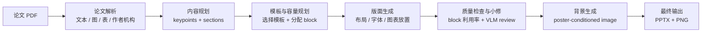

# Paper2Poster

Paper2Poster 是一个把论文 PDF 自动转换成学术海报的多智能体系统。当前目标不是做一个完全产品化的工具，而是验证一条可行的 research prototype pipeline：从论文解析、内容提炼、模板适配、版面渲染，到视觉质量检查和最终 PPTX/PNG 输出。

目前系统已经可以生成可编辑的 PowerPoint 海报，并支持标准模板、无模板自适应布局、局部/全局 VLM 质检，以及基于最终 poster 生成淡色学术背景图。

## 当前进展

目前已经完成的核心能力：

- PDF 解析：抽取正文、作者、机构、图、表和结构化章节。
- 论文内容切块：用 prompt 从全文中提取约 10 个适合 poster 展示的 keypoints。
- 模板优先规划：先确定模板和 block 大小，再根据容量组织每个 block 的文字和视觉资产。
- 标准模板选择：`auto` 模式只从少量质量较好的模板中选择，避免扫描所有不可控模板。
- 版面微调：通过确定性 micro-layout 尽量避免重叠、溢出和文字越界。
- 局部质检：对每个 block 估算利用率，并用 VLM crop review 判断空白、拥挤、溢出和图表可读性。
- 背景生成：先渲染 poster 前景，再把 poster 作为参考图交给 `gpt-image-2` 生成淡色学术背景。
- 最终输出：生成可编辑 `.pptx` 和预览 `.png`。

当前横版效果明显优于竖版。竖版模板因为 block 太少、空间比例不稳定，暂时不建议作为默认展示模式。

## 简化流程

主入口在 [src/workflow/pipeline.py](src/workflow/pipeline.py)。



更具体一点：

```text
PDF 输入
 -> 解析论文文本、图表、作者和机构
 -> 选择标准模板或自适应布局模式
 -> 根据模板 block 面积计算文字和图表容量
 -> 从论文中提取约 10 个 poster keypoints
 -> 将 keypoints 合并成 4-7 个 poster sections
 -> 生成布局、字体、颜色和图表放置
 -> 渲染 draft poster
 -> 检查 block 空白、拥挤、溢出和图表可读性
 -> 必要时做一次小修
 -> 生成淡色学术背景
 -> 渲染最终 PPTX / PNG
```

## 关键设计

### 1. 模板优先，而不是生成后硬修

之前的问题是：先生成内容，再放进模板，最后发现 block 里面空白很多，只能靠后处理补救。

现在改成：

```text
先选模板 -> 计算每个 block 的容量 -> 再生成对应长度的内容
```

这样可以让初稿就更接近目标利用率，减少后面反复重排。

### 2. Keypoints 作为内容池

系统会先从论文中提取约 10 个 poster-worthy keypoints。它们不是强制一一对应模板 block，而是作为内容池，由 curator 按模板结构合并成若干 poster sections。

比如一个 6 block 模板可以把 10 个 keypoints 合并成：

```text
问题背景 / 核心方法 / 系统流程 / 实验设置 / 主要结果 / 结论启示
```

### 3. Block 利用率目标

当前每个 block 的目标利用率：

```text
target_utilization = 0.965
acceptable_range = 0.96 - 0.992
hard_max = 0.995
final_min = 0.96
final_mean = 0.965
final_bottom_whitespace <= min(0.6", 4% of block height)
```

如果 block 偏空，系统只允许从论文事实中补充内容；如果 block 太挤或溢出，只允许压缩或删减。禁止为了填满而编造论文没有的实验结果。

### 4. VLM 只负责检查和小修建议

当前 VLM 不负责决定整个布局，也不负责大幅重写内容。它主要做两类检查：

- 局部检查：每个 block 是否空、刚好、太挤、溢出、图表文字太小。
- 全局检查：标题是否可读、布局是否平衡、阅读顺序是否自然、是否有大面积空白。

核心布局仍然由模板容量和确定性规则控制。

### 5. 背景图是最后加的

背景不是一开始就参与布局，而是在 draft poster 已经生成后：

```text
draft poster PNG
 -> 作为 reference 交给 image model
 -> 生成同尺寸淡色学术背景
 -> 后处理降低干扰
 -> 放到最终 PPT 底层
```

这样背景不会影响正文、图表和 logo 的布局。

## 模板策略

当前不再使用旧的 `template/json` / `template/picture` 模板库。新的标准模板来自：

```text
模版-横向/
模版-竖向/
```

运行时会给模板 ID 加方向后缀，避免横向和竖向同名 cluster 冲突，例如 `cluster_27_landscape` 和 `cluster_27_portrait`。

标准模板白名单：

```text
横版：cluster_2_landscape, cluster_6_landscape, cluster_14_landscape, cluster_16_landscape,
      cluster_27_landscape, cluster_36_landscape, cluster_39_landscape, cluster_43_landscape,
      cluster_46_landscape, cluster_62_landscape, cluster_69_landscape, cluster_70_landscape,
      cluster_85_landscape, cluster_86_landscape, cluster_96_landscape, cluster_104_landscape
竖版：cluster_3_portrait, cluster_8_portrait, cluster_13_portrait, cluster_15_portrait,
      cluster_22_portrait, cluster_25_portrait, cluster_27_portrait, cluster_29_portrait
```

当前建议：

- 默认使用 `auto`。
- 多图表、内容密度较高的论文优先使用 `cluster_104_landscape` 横版。
- 需要 6 个内容 block 的横版可手动使用 `cluster_43_landscape`。
- 如果模板限制太强，可以使用 `adaptive_auto` 无模板自适应模式。
- 竖版模板目前只作为实验能力保留，不建议作为默认展示效果。

## 安装

推荐 Python 3.11。

```bash
python -m venv .venv
source .venv/bin/activate
pip install -r requirements.txt
```

如果使用 `uv`：

```bash
uv sync
```

## 环境变量

参考 [.env.example](.env.example) 创建 `.env`。

最小配置：

```bash
OPENAI_API_KEY=your_key_here
OPENAI_API_BASE=https://your-text-endpoint/v1
OPENAI_BASE_URL=https://your-text-endpoint/v1
```

VLM 质检：

```bash
VLM_API_KEY=your_vlm_key
VLM_BASE_URL=https://your-vlm-endpoint/v1
VLM_MODEL=gpt-5.4
```

背景图生成：

```bash
IMAGE_API_KEY=your_image_key
IMAGE_BASE_URL=https://your-image-endpoint/v1
IMAGE_MODEL=gpt-image-2
```

多个图片中转站可以这样配置：

```bash
IMAGE_BASE_URLS="https://endpoint-1/v1 https://endpoint-2/v1 https://endpoint-3/v1"
IMAGE_RETRY_ATTEMPTS=5
IMAGE_RETRY_DELAY_SECONDS=6
```

不要提交 `.env` 或任何真实 API key。

## 快速运行

查看模板列表：

```bash
PYTHONPATH=. .venv/bin/python -m src.workflow.pipeline --list-layout-templates
```

推荐运行方式：

```bash
PYTHONPATH=. .venv/bin/python -m src.workflow.pipeline \
  data/Active_Geospatial_Search_for_Efficient_Tenant_Eviction_Outreach/paper.pdf \
  --layout-template auto \
  --logo data/Active_Geospatial_Search_for_Efficient_Tenant_Eviction_Outreach/logo.png \
  --aff-logo data/Active_Geospatial_Search_for_Efficient_Tenant_Eviction_Outreach/aff.png \
  --poster-style navy_serif \
  --visual-density rich \
  --enable-generated-background \
  --background-palette light_blue
```

可选视觉风格：

```text
--poster-style navy_serif | teal_modern | burgundy_classic
```

可选图表密度：

```text
--visual-density lean | balanced | rich
```

`balanced` 是默认值。论文图表较多、表格比较可读时建议用 `rich`，会优先保留方法图、系统图和关键结果表；空间紧张或竖版实验时可用 `lean`。

可选 header 样式：

```text
--header-route auto | classic_left | centered | right_title | split_logos
--header-subtitle auto | off | always
--header-seed 42
```

默认 `auto` 会为每次 poster 从合格路线中选择一种：左标题右 logo、居中标题、右对齐标题或左右分布 logo。短标题可以自动加入较小字号副标题；如果需要稳定复现实验效果，传入 `--header-seed`。

可选小标题编号：

```text
--section-title-numbering off | small | inline
```

默认 `off`，小标题不显示编号；`small` 会在标题左侧显示较小编号；`inline` 保留旧版 `1. Title` 形式。

可选 AI teaser 图：

```text
--enable-generated-teaser
```

默认不生成 teaser，流程会按论文原始图表和模板正常排版。只有显式传入 `--enable-generated-teaser` 时，pipeline 才会为 introduction/motivation 类 block 生成一张论文相关的顶会风格概念图，并自动压缩该 block 下方文字摘要。

带 teaser 的运行示例：

```bash
PYTHONPATH=. .venv/bin/python -m src.workflow.pipeline \
  data/Active_Geospatial_Search_for_Efficient_Tenant_Eviction_Outreach/paper.pdf \
  --layout-template auto \
  --logo data/Active_Geospatial_Search_for_Efficient_Tenant_Eviction_Outreach/logo.png \
  --aff-logo data/Active_Geospatial_Search_for_Efficient_Tenant_Eviction_Outreach/aff.png \
  --poster-style navy_serif \
  --visual-density rich \
  --enable-generated-teaser \
  --enable-generated-background \
  --background-palette light_blue
```

固定使用当前效果较好的横版模板：

```bash
PYTHONPATH=. .venv/bin/python -m src.workflow.pipeline \
  data/Active_Geospatial_Search_for_Efficient_Tenant_Eviction_Outreach/paper.pdf \
  --layout-template cluster_43_landscape \
  --logo data/Active_Geospatial_Search_for_Efficient_Tenant_Eviction_Outreach/logo.png \
  --aff-logo data/Active_Geospatial_Search_for_Efficient_Tenant_Eviction_Outreach/aff.png \
  --enable-generated-background
```

无模板自适应模式：

```bash
PYTHONPATH=. .venv/bin/python -m src.workflow.pipeline \
  data/Active_Geospatial_Search_for_Efficient_Tenant_Eviction_Outreach/paper.pdf \
  --layout-template adaptive_auto \
  --logo data/Active_Geospatial_Search_for_Efficient_Tenant_Eviction_Outreach/logo.png \
  --aff-logo data/Active_Geospatial_Search_for_Efficient_Tenant_Eviction_Outreach/aff.png
```

## 输出目录

默认输出：

```text
output/<paper_directory_name>/
```

典型结构：

```text
output/<paper>/
├── <paper>.pptx
├── <paper>.png
├── timing_cost_log.json
├── assets/
│   ├── figure-*.png
│   ├── table-*.png
│   ├── generated_background.png
│   └── resolved/
└── content/
    ├── raw.md
    ├── structured_sections.json
    ├── poster_keypoint_selection.json
    ├── story_board.json
    ├── block_capacity_contract.json
    ├── template_block_plan.json
    ├── styled_layout.json
    ├── micro_layout_report.json
    ├── block_occupancy_report.json
    ├── block_vlm_review.json
    ├── visual_legibility_review.json
    ├── vlm_layout_review.json
    ├── background_image_report.json
    └── final_quality_gate.json
```

调试时最常看：

- `poster_keypoint_selection.json`：论文被切成了哪些 keypoints。
- `story_board.json`：keypoints 如何合并成 poster sections。
- `styled_layout.json`：最终元素位置和字体。
- `micro_layout_report.json`：是否有重叠或溢出。
- `block_occupancy_report.json`：各 block 利用率。
- `final_quality_gate.json`：最终是否通过，以及失败原因。

## 测试

运行合同测试：

```bash
PYTHONPATH=. .venv/bin/python -m pytest tests/test_pipeline_contracts.py
```

当前本地结果：

```text
106 passed, 2 warnings
```

## 目录结构

```text
paper2poster/
├── assets/                  # 会议 logo 等静态资源
├── config/                  # 配置和 prompts
│   ├── poster_config.yaml
│   └── prompts/
├── data/                    # demo 论文和本地测试输入
├── docs/                    # 进度记录和说明文档
├── output/                  # 生成结果，可删除重跑
├── src/
│   ├── agents/              # pipeline 各阶段 agent
│   ├── config/              # 配置加载
│   ├── layout/              # 模板选择和布局辅助
│   ├── state/               # PosterState 状态定义
│   ├── template_extraction/ # 模板 registry 和抽取
│   ├── tools/               # image / layout / pptx 封装
│   ├── utils/               # 文本清洗和 logo 工具
│   └── workflow/            # pipeline 入口
├── template/
│   ├── json/                # cluster 模板结构
│   └── picture/             # cluster 模板预览图
├── tests/
├── utils/
├── requirements.txt
└── README.md
```

## 重点模块

- [src/workflow/pipeline.py](src/workflow/pipeline.py)：主流程和 CLI。
- [src/agents/parser.py](src/agents/parser.py)：PDF 解析、图表抽取。
- [src/agents/poster_keypoint_selector.py](src/agents/poster_keypoint_selector.py)：论文 keypoint 提取。
- [src/agents/template_capacity_planner.py](src/agents/template_capacity_planner.py)：模板 block 容量估计。
- [src/agents/curator.py](src/agents/curator.py)：poster 内容规划。
- [src/agents/template_block_planner.py](src/agents/template_block_planner.py)：section 到模板 slot 的映射。
- [src/agents/micro_layout_refiner.py](src/agents/micro_layout_refiner.py)：确定性微排版。
- [src/agents/block_occupancy_analyzer.py](src/agents/block_occupancy_analyzer.py)：block 利用率计算。
- [src/agents/block_content_refiner.py](src/agents/block_content_refiner.py)：小幅补文和压缩。
- [src/agents/background_image_agent.py](src/agents/background_image_agent.py)：poster-conditioned 背景图生成。
- [src/agents/renderer.py](src/agents/renderer.py)：PPTX 和 PNG 渲染。
- [src/utils/text_cleanup.py](src/utils/text_cleanup.py)：清理 OCR 路径、表号引用、metadata 泄漏和截断残句。

## 已知问题

1. 竖版模板目前效果较差。主要原因是 block 太少、比例不适合 dense paper，容易出现大留白或局部挤压。
2. 部分新模板并不可用。当前建议只维护少量标准模板，不要盲目扫描所有模板。
3. VLM final gate 有帮助，但不能完全替代人工目视检查。
4. 图表可读性仍然是难点。当前主要是裁剪、缩放和必要时转文字总结，还没有真正重绘图表。
5. 运行时间较长，因为包含 PDF 解析、LLM、VLM、背景图生成和微排版。
6. 生成结果是可编辑 PPTX，但最终展示前仍可能需要人工微调。
