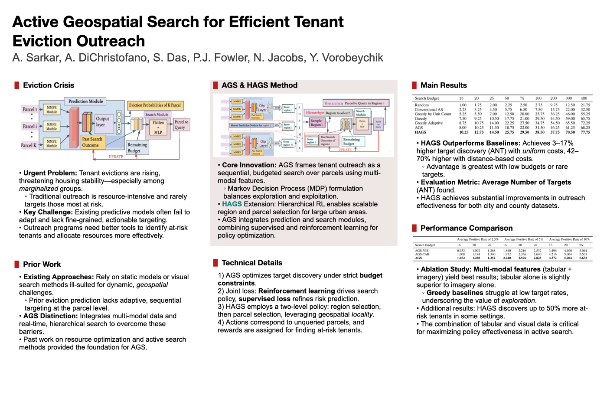
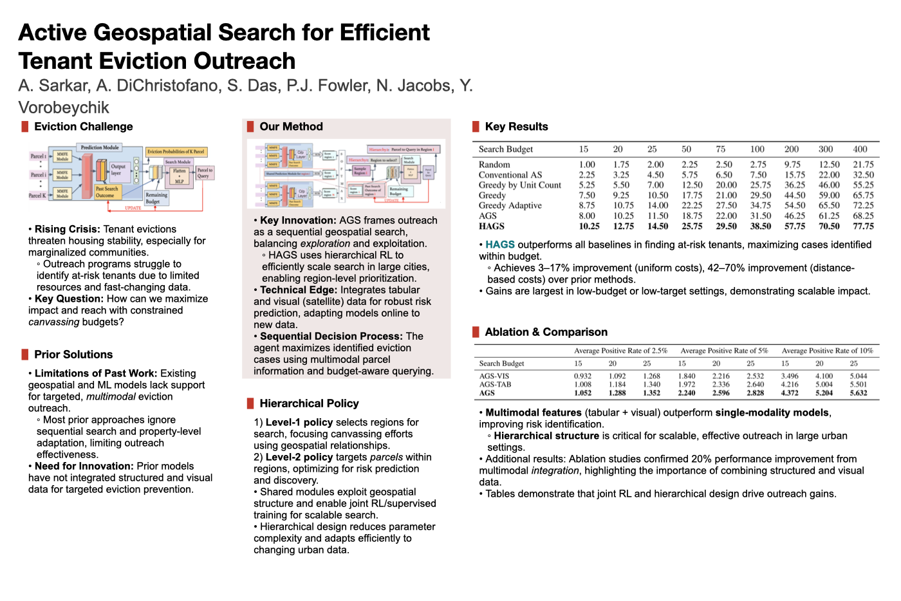
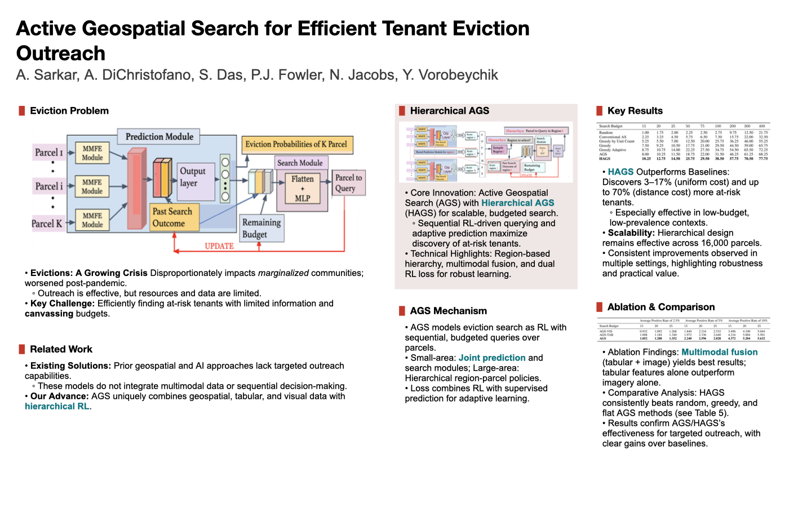

# PosterMELD Pipeline 概览

这份文档只讲四件事：

1. 整体 pipeline 怎么跑
2. 三个封装工具分别在哪一步使用
3. 三种模板和微调算法做了什么
4. 最终效果长什么样

---

## 1. 整体 Pipeline

当前主链定义在 [pipeline.py](../src/workflow/pipeline.py)：

```text
PDF
  -> parser
  -> affiliation_logo_agent
  -> curator
  -> template_block_planner
  -> color_agent
  -> section_title_designer
  -> layout_with_balancer
  -> font_agent
  -> micro_layout_refiner
  -> visual_asset_agent
  -> renderer
  -> visual_legibility_reviewer
  -> vlm_layout_reviewer
  -> optional repair
  -> final renderer
  -> PPTX / PNG
```

每一步的职责可以压缩成一句话：

- `parser`：从 PDF 抽文本、图、表，建立 `visual_assets`
- `affiliation_logo_agent`：解析作者单位并准备机构 logo
- `curator`：把论文内容整理成适合海报的 `story_board`
- `template_block_planner`：根据竖版模板 block 数量和大小分配内容
- `color_agent`：生成主题色
- `section_title_designer`：生成章节标题视觉样式
- `layout_with_balancer`：做初始布局、列平衡、最终布局
- `font_agent`：注入文本样式和关键词高亮
- `micro_layout_refiner`：做最后一轮无重叠/无溢出的确定性微调
- `visual_asset_agent`：把原始视觉资产解析到具体 layout slot
- `renderer`：只负责输出 `.pptx` 和 `.png`
- `visual_legibility_reviewer`：检查图表中文字可读性
- `vlm_layout_reviewer`：检查整体留白、阅读流和视觉层级
- `optional repair`：必要时走 `template_region_relayout` 或自适应重排后再渲染

当前已经实现并跑通的是：

- `PDF -> 可编辑 .pptx / .png`
- 三种内置模板和四种竖版模板都能走完整条链
- 验收标准不是“生成了文件”，而是 `micro_layout_report.json` 里 `validation.issues = []`

---

## 2. 三个封装工具在哪用

### 2.1 `ImageTools`

文件：

- [image_api.py](../src/tools/image_api.py)

当前用途：

- 由 [visual_asset_agent.py](../src/agents/visual_asset_agent.py) 调用
- 当前默认主要使用 `crop_and_resize`
- `generate_image` / `edit_image` 已封装，但默认主链还没有把“主动生图 / 改图”作为必经步骤打开

一句话理解：

- `ImageTools` 负责“图怎么处理”

### 2.2 `LayoutTemplates`

文件：

- [layout_api.py](../src/tools/layout_api.py)

当前用途：

- 被 [layout_agent.py](../src/agents/layout_agent.py)
- [curator.py](../src/agents/curator.py)
- [micro_layout_refiner.py](../src/agents/micro_layout_refiner.py)

共同使用

一句话理解：

- `LayoutTemplates` 负责“版式几何是什么”

### 2.3 `PPTXDirector`

文件：

- [pptx_api.py](../src/tools/pptx_api.py)

当前用途：

- 由 [renderer.py](../src/agents/renderer.py) 调用
- 负责文本框、形状、连接线、图片和最终 `.pptx` 保存

一句话理解：

- `PPTXDirector` 负责“怎么真正画到 PowerPoint 上”

---

## 3. 模板与微调算法

### 3.1 已实现的模板

当前支持手动选择三种内置模板：

- `three_column_postergen`
- `two_plus_one_mixed`
- `one_plus_two_mixed`

它们的区别很简单：

- `three_column_postergen`：三等宽栏，最稳
- `two_plus_one_mixed`：左两窄栏，右一宽栏
- `one_plus_two_mixed`：左一宽栏，右两窄栏

同时已经接入四个竖版结构模板：

- `cluster_0`：多 block 竖版，适合内容较多、方法和结果都要展示的 poster
- `cluster_1`：左右交错式竖版，适合分区明显、想突出结构变化的 poster
- `cluster_2`：上方双块 + 中下大块，适合突出一个核心方法图和一个主要结果表
- `cluster_3`：右侧长块 + 底部大块，适合一侧放背景/动机，底部突出核心方法或结果

CLI 入口在 [pipeline.py](../src/workflow/pipeline.py)：

```bash
--layout-template {auto,three_column_postergen,two_plus_one_mixed,one_plus_two_mixed,cluster_0,cluster_1,cluster_2,cluster_3}
```

### 3.2 微调算法做了什么

核心模块：

- [micro_layout_refiner.py](../src/agents/micro_layout_refiner.py)

这层不是 LLM，而是确定性后处理。可以把它理解成一个 lane 级的几何收敛器：

- 输入：已经有字体样式的 `styled_layout`
- 输出：一个能真正放进模板栏位里的最终布局

#### 用公式理解

对每个 lane，先计算它的可用高度：

```text
lane_bottom = lane_y + lane_h
```

然后把这个 lane 里所有 section 从上到下重新排一遍。每个 section 的总高度可近似写成：

```text
section_height
  = title_height
  + title_to_content_gap
  + sum(visual_height_i + visual_gap)
  + sum(text_height_j)
```

整个 lane 排完后的实际使用高度：

```text
used_height = last_section_bottom - lane_y
```

overflow 的定义是：

```text
overflow = used_height - lane_h
```

判定规则很直接：

- `overflow <= 0`：这栏已经放得下
- `overflow > 0`：这栏还在溢出，继续收紧

每次收紧时，参数按固定方向更新：

```text
section_gap          = max(min_section_gap, section_gap - step)
title_to_content_gap = max(min_gap, title_to_content_gap - step)
visual_gap           = max(min_visual_gap, visual_gap - step)
text_padding         = max(min_padding, text_padding - step)
body_font_size       = max(min_body_font_size, body_font_size - step)
title_font_size      = max(min_title_font_size, title_font_size - step)
visual_scale         = max(min_visual_scale, visual_scale - step)
```

也就是说，它本质上在解一个很简单的问题：

```text
find params
such that overflow(params) <= 0
```

#### 用流程图理解

```mermaid
flowchart TD
    A[输入 styled_layout + template lanes] --> B[按 lane 分组 section]
    B --> C[重新测量标题 / 正文 / 图片高度]
    C --> D[按当前参数重新排版]
    D --> E{overflow <= 0 ?}
    E -- 是 --> F[保留当前结果]
    E -- 否 --> G{达到 max_iterations ?}
    G -- 否 --> H[收紧 gap / 字号 / padding / visual scale]
    H --> C
    G -- 是 --> I[进入 force-fit 兜底压缩]
    I --> J[做最终 validation]
    F --> J
    J --> K{issues == [] ?}
    K -- 是 --> L[输出 refined styled_layout]
    K -- 否 --> M[记为失败]
```

#### 它具体会调什么

- `section gap`
- `title/body font size`
- `visual scale`
- `text padding`
- lane 内 section 的纵向位置

#### 它不做什么

- 不重写 `story_board`
- 不重新决定模板
- 不依赖 LLM 临场猜布局

所以它不是“重新设计海报”，而是“在既定模板里把内容压到安全可渲染状态”。

目标只有三个：

- 不重叠
- 不越界
- 不在栏内溢出

最终它会输出：

- `output/<poster_name>/content/micro_layout_report.json`

验收方法很直接：

- `validation.issues == []` 说明通过

### 3.3 当前实现结论

现在不是只有单一模板能跑，而是：

- 三栏 / `2+1` / `1+2` 都能手动选择
- 三种模板都接了同一套 `micro_layout_refiner`
- 三种模板都已经用真实论文完成端到端验证

---

## 4. 效果展示

下面三张图都来自真实生成结果，不是示意图。

### 三栏 `three_column_postergen`



对应 PPTX 可通过 README 中的 Quick Start 命令重新生成到 `output/<poster_name>/`。

### `2+1` 混合栏 `two_plus_one_mixed`



对应 PPTX 可通过 README 中的 Quick Start 命令重新生成到 `output/<poster_name>/`。

### `1+2` 混合栏 `one_plus_two_mixed`



对应 PPTX 可通过 README 中的 Quick Start 命令重新生成到 `output/<poster_name>/`。
