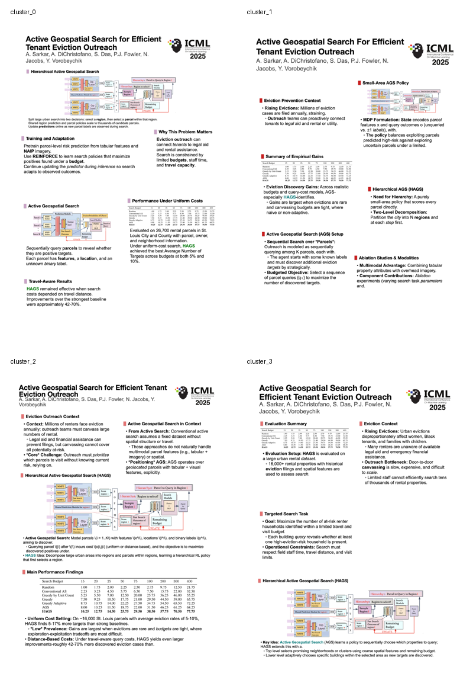

# 5.15-5.19 周进展：将模板加入 Paper2Poster Pipeline

本周重点是把前期构建出的四个竖版模板真正接入 Paper2Poster 主流程。当前系统已经从“能跑通”升级到“可选择模板、可自检、可修正、可稳定输出”的版本。

## 1. 当前完整流程

```text
PDF
  -> parser
  -> affiliation_logo_agent
  -> curator
  -> template_block_planner
  -> color_agent
  -> section_title_designer
  -> layout_with_balancer
  -> font_agent
  -> micro_layout_refiner
  -> visual_asset_agent
  -> renderer
  -> visual_legibility_reviewer
  -> vlm_layout_reviewer
  -> optional repair
  -> final renderer
  -> PPTX / PNG
```

核心特点：

- `parser` 抽取论文文本、图、表，并建立统一 `visual_assets`。
- `curator` 把论文内容压缩成 poster story board。
- `template_block_planner` 根据所选模板的 block 数量和大小分配内容。
- `micro_layout_refiner` 做确定性几何检查，保证无重叠、无溢出。
- `visual_asset_agent` 统一处理图片 / 表格 slot 映射。
- `visual_legibility_reviewer` 检查图表中文字是否过小、表格是否过密。
- `vlm_layout_reviewer` 对最终截图做可读性、留白、阅读流和视觉层级检查。
- `renderer` 只负责输出 `.pptx` 和 `.png`，不做内容或图片决策。

## 2. 本周主要改进

这周重点是模板库重新接入和版面质量控制。

主要完成了：

- 正确识别 `template/` 里的 4 套模板都是竖版模板。
- `cluster_0 ~ cluster_3` 自动使用竖版画布，默认约 `36 x 50.876 in`。
- 模板不再被错误塞进横版三栏，而是直接使用模板 JSON 中的真实 slot。
- 模板 JSON 中的 slot 被转换为真实 poster block。
- 内容会按 block 大小、重要性和视觉需求分配，而不是机械填满。
- key visual 优先进入大块，小块优先放短文本摘要。
- VLM 作为质检门禁，检查留白、图中文字过小、阅读流和视觉层级。
- 修复了文字 / 图块误归属导致的假 overflow 问题。
- 修复了文本硬截断导致的异常缩写问题。
- 修复了标题和会议 logo 在竖版模板中重合的问题。

## 3. 模板选择

现在可以直接通过 `--layout-template` 选择模板。

四个竖版结构模板：

- `cluster_0`：多 block 竖版，适合内容较多、方法和结果都要展示的 poster。
- `cluster_1`：左右交错式竖版，适合分区明显、想突出结构变化的 poster。
- `cluster_2`：上方双块 + 中下大块，适合突出一个核心方法图和一个主要结果表。
- `cluster_3`：右侧长块 + 底部大块，适合一侧放背景 / 动机，底部突出核心方法或结果。

三种内置版式：

- `three_column_postergen`：三栏基线，阅读流最稳定，适合作为 baseline。
- `two_plus_one_mixed`：右侧宽栏，适合结果表或宽图较重要的论文。
- `one_plus_two_mixed`：左侧宽栏，适合方法区或问题背景占比更高的论文。

## 4. 当前验证结果

四个竖版模板已经用同一篇 demo 论文跑通过：

| Template | Output | Micro Layout | Force Fit | VLM |
| --- | --- | --- | --- | --- |
| `cluster_0` | `output/0409_demo_portrait_cluster_0/` | `0 issues` | `false` | `accept=true` |
| `cluster_1` | `output/0409_demo_portrait_cluster_1/` | `0 issues` | `false` | `accept=true` |
| `cluster_2` | `output/0409_demo_portrait_cluster_2/` | `0 issues` | `false` | `accept=true` |
| `cluster_3` | `output/0409_demo_portrait_cluster_3/` | `0 issues` | `false` | `accept=true` |

模板总览：



## 5. 当前结论

本周的主要进展可以概括为：

- Paper2Poster 已经具备“生成 - 检查 - 修正 - 再渲染”的闭环。
- 四个竖版模板已经从静态模板文件变成 pipeline 中可选择、可运行、可检查的版式。
- 版面质量不只靠生成结果主观判断，而是通过 `micro_layout_report` 和 VLM review 双重检查。
- 当前最适合展示的竖版模板是 `cluster_2`，整体稳定性和视觉效果更好。
- 后续重点应继续增强 `visual_asset_agent`，让系统不仅能裁剪原图，还能判断是否需要编辑、重绘或新增概念图。
